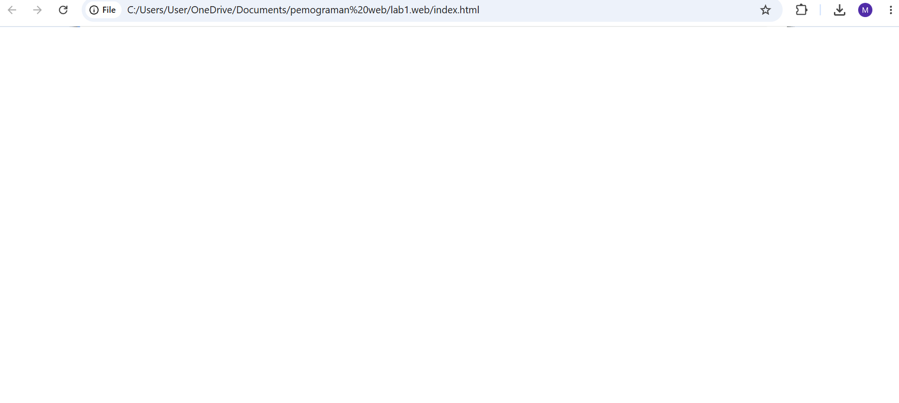
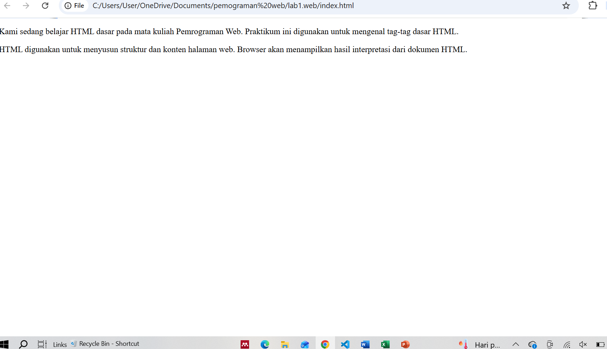
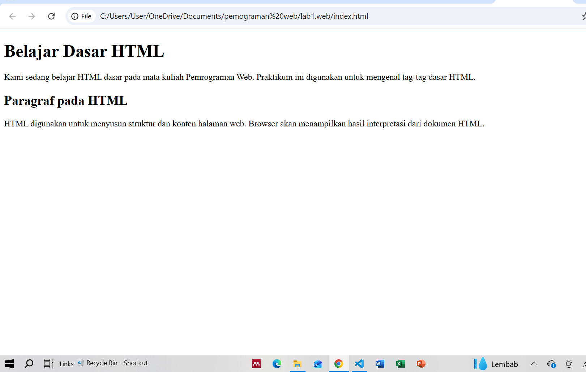
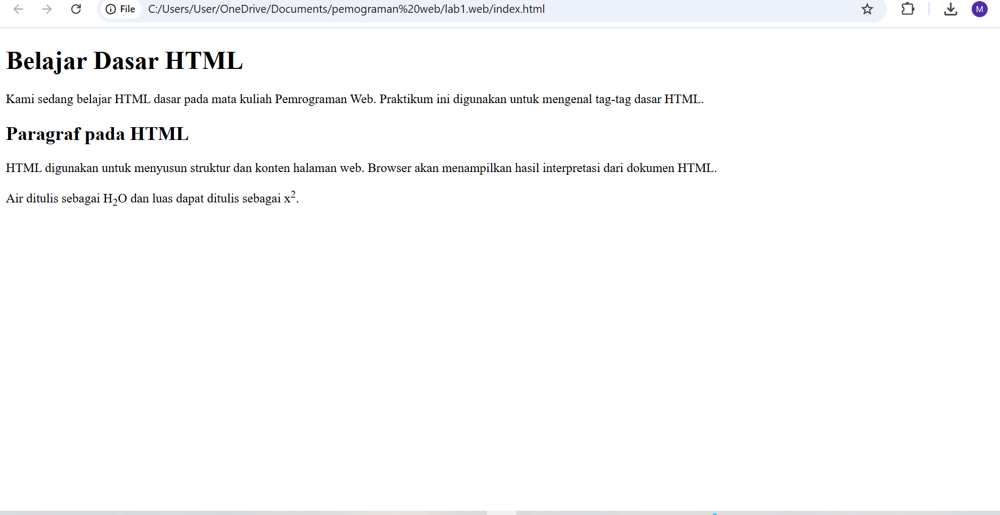
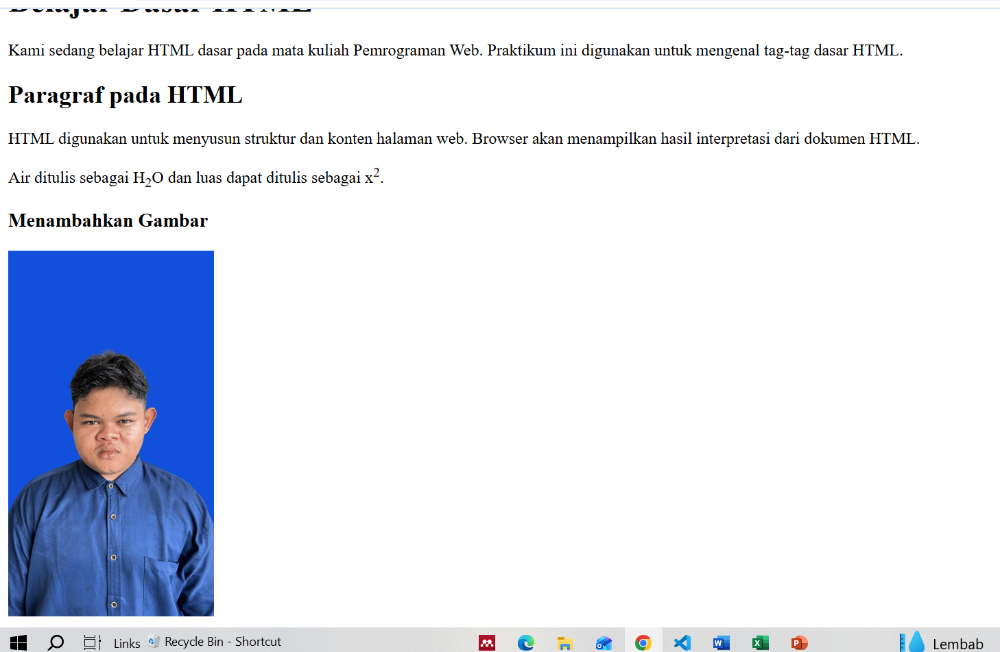
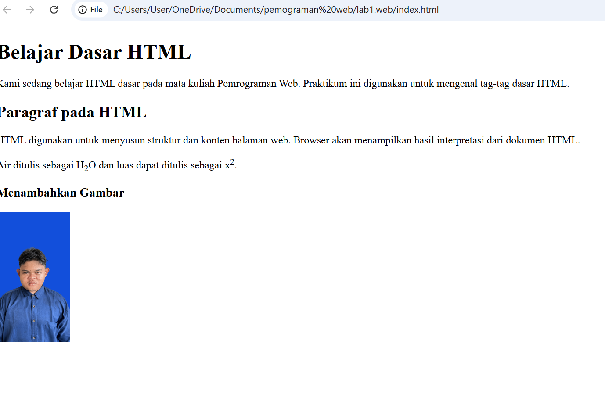
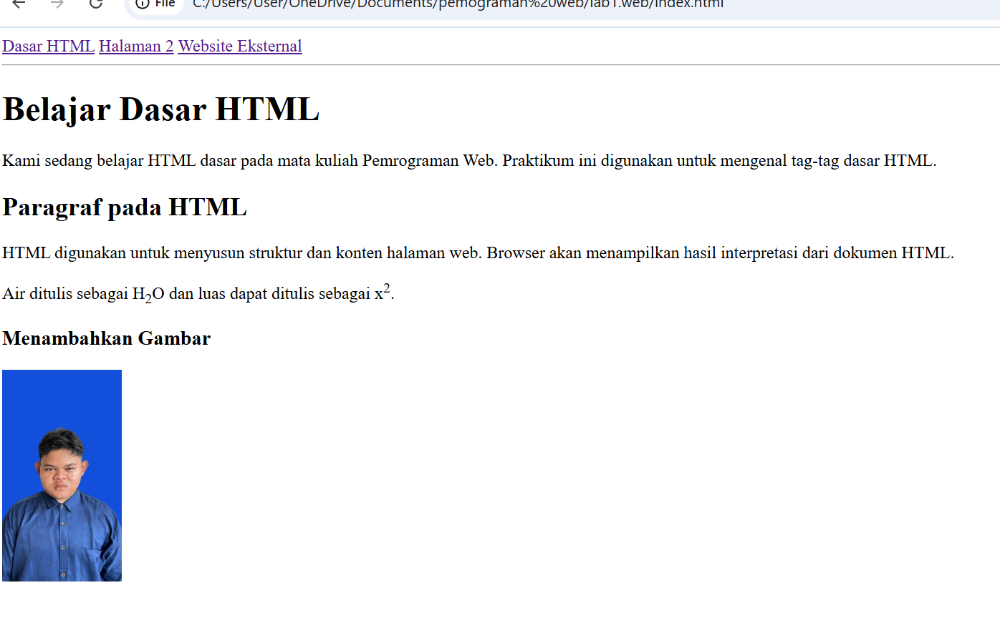
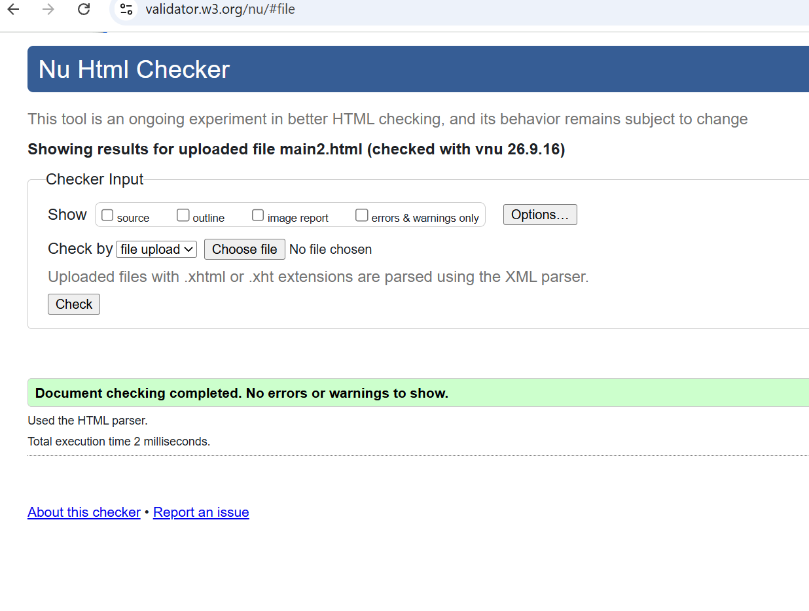

# PRAKTIKUM 1 - HTML DASAR

## Identitas Mahasiswa

**Nama:** MUKTI ADRIANDYAH  
**Program Studi:** Teknik Informatika  
**Mata Kuliah:** Pemrograman Web  
**Praktikum:** 1 - HTML Dasar

---

## A. Tujuan Praktikum

Praktikum ini bertujuan untuk:

1. Memahami struktur dasar HTML.
2. Memahami tag-tag dasar HTML.
3. Membuat dokumen HTML.
4. Memahami penggunaan atribut pada HTML.
5. Membuat halaman web sederhana menggunakan HTML.

---

## B. Alat dan Bahan

Alat dan bahan yang digunakan dalam praktikum ini adalah:

1. Visual Studio Code sebagai text editor.
2. Web Browser untuk menampilkan halaman HTML.
3. HTML5.
4. Folder project dengan nama `Lab1Web`.

---

## C. Struktur Folder

Struktur folder yang digunakan dalam praktikum adalah:

```text
Lab1Web/
├── index.html
├── halaman2.html
├── images/
│   └── profil.jpg
├── screenshots/
└── README.md


D. Langkah-Langkah Praktikum

1. Membuat Struktur Dasar HTML
Pada tahap pertama dibuat file index.html dengan struktur dasar HTML.
Struktur dasar HTML terdiri dari <!DOCTYPE html>, <html>, <head>, <title>, dan <body>.
Struktur tersebut digunakan sebagai dasar untuk membuat sebuah halaman web.
```

2. Membuat Paragraf
Pada tahap kedua dibuat beberapa paragraf menggunakan tag <p>.
Tag <p> digunakan untuk menampilkan teks dalam bentuk paragraf pada halaman web.
Paragraf yang dibuat berisi penjelasan mengenai pembelajaran HTML dasar dan fungsi HTML dalam menyusun struktur halaman web

3. Menambahkan Judul
Pada tahap ini ditambahkan heading menggunakan tag h1 dan h2.
Tag h1 digunakan sebagai judul utama, sedangkan h2 digunakan sebagai subjudul.

4. Memformat Teks
Pada tahap ini dilakukan pemformatan teks menggunakan beberapa tag HTML.
Tag yang digunakan antara lain:
b untuk membuat teks tebal.
i untuk membuat teks miring.
strong untuk menunjukkan teks penting.
em> untuk memberikan penekanan pada teks.
mark untuk memberikan penanda pada teks.
small untuk membuat teks berukuran lebih kecil.
del untuk menunjukkan teks yang dihapus.
ins untuk menunjukkan teks yang ditambahkan.
sub untuk membuat teks subscript.
sup untuk membuat teks superscript.

5. Menyisipkan Gambar
Pada tahap ini ditambahkan gambar menggunakan tag .
Gambar profil disimpan di dalam folder images.
Struktur folder gambar:
Lab1Web/
└── images/
    └── profil.jpg
Atribut yang digunakan pada gambar adalah:
src untuk menentukan lokasi gambar.
width untuk menentukan ukuran lebar gambar.
alt untuk memberikan deskripsi gambar.
title untuk memberikan keterangan gambar.

6. Mengatur Ukuran Gambar
Pada tahap ini dilakukan percobaan mengatur ukuran gambar menggunakan atribut width.
Ukuran gambar dapat diubah dengan mengubah nilai pada atribut width.

7. Menambahkan Hyperlink
Pada tahap ini dibuat file kedua dengan nama halaman2.html.
Hyperlink digunakan untuk menghubungkan satu halaman dengan halaman lainnya.
Hyperlink internal yang dibuat adalah:
Beranda
Halaman 2
Selain hyperlink internal, dibuat juga hyperlink eksternal menuju Google.

8. Menambahkan List
Pada tahap ini dibuat dua jenis list yaitu unordered list dan ordered list.
Unordered List
Unordered list digunakan untuk membuat daftar tanpa nomor.
Daftar keahlian yang dibuat:
HTML
CSS
JavaScript

Ordered List
Ordered list digunakan untuk membuat daftar yang memiliki urutan.
Urutan belajar yang dibuat:
Mempelajari struktur HTML.
Mempelajari tag dan atribut.
Membuat halaman HTML.
Menguji halaman pada browser.

9. Menambahkan Komentar
Pada tahap ini ditambahkan komentar pada kode HTML.
omentar tidak ditampilkan pada halaman browser.
Komentar digunakan untuk memberikan catatan atau penjelasan pada kode HTML.

E. HASIL AKHIR PRAKTIKUM
Pada tahap akhir seluruh elemen HTML yang telah dipelajari digabungkan menjadi sebuah halaman Profil Mahasiswa.
Halaman Profil Mahasiswa terdiri dari:
Navigasi halaman.
Judul Profil Mahasiswa.
Foto profil.
Data diri.
Program studi.
Keahlian.
Target belajar.
Paragraf.
Pemformatan teks.
Hyperlink.


DOKUMENTASI:
















BUKTI VALIDATOR HTML



